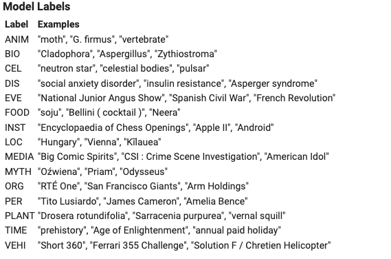
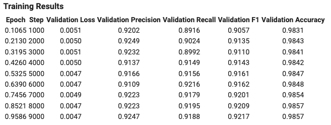
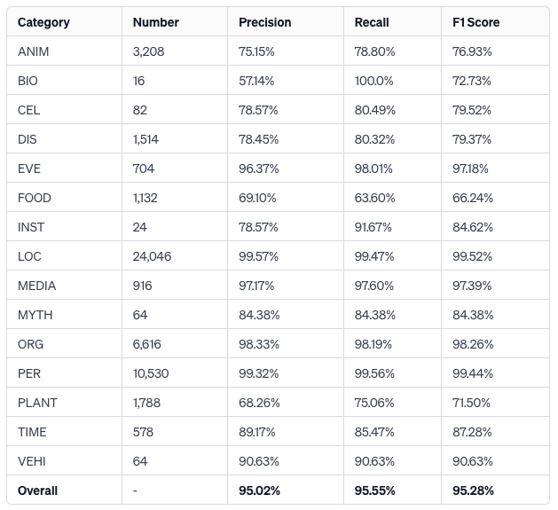
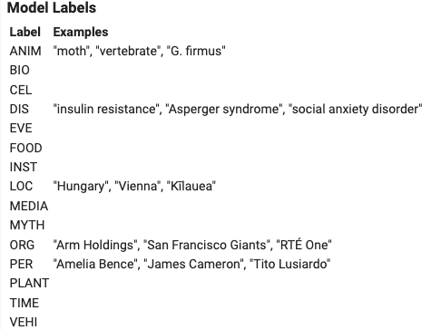
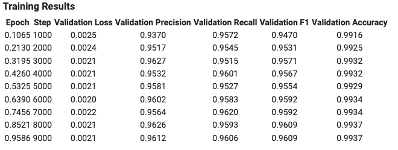
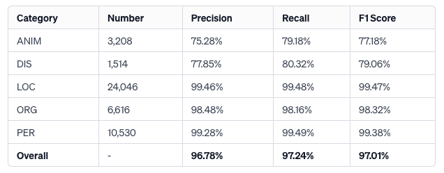

# MultiNERD Fine-Tuning Project

## Description
This project involves fine-tuning a language model on the [MultiNERD dataset](https://huggingface.co/datasets/Babelscape/multinerd?row=17) for Named Entity Recognition (NER) tasks. The focus is on two systems:
- System A: Fine-tuning on the English subset.
- System B: Fine-tuning on a subset of the dataset with specific 5 entity types: `PERSON(PER), ORGANIZATION(ORG), LOCATION(LOC), DISEASES(DIS), ANIMAL(ANIM)` as well as the `O` tag (all other entities will be set to zero).

## Requirements
To install the required packages, run:
```
pip install -r requirements.txt
```
### Framework Versions
Python: 3.10.12

SpanMarker: 1.5.0

Transformers: 4.35.2

PyTorch: 2.1.0+cu118

Datasets: 2.15.0

Tokenizers: 0.15.0

## Usage
The project has been done on Google Colab (with 1 V100 GPU).

For details, please see `Named Entity Recognition.ipynb`.

## Dataset
The dataset used is the MultiNERD dataset, which is a multi-lingual NER dataset. 
For System A, the dataset is the English subset.
For System B, the dataset is filtered to include only certain entity types.

## Models
The pre-trained model [tomaarsen/span-marker-mbert-base-multinerd](https://huggingface.co/tomaarsen/span-marker-mbert-base-multinerd) used for fine-tuning comes from Hugging Face's Transformers library.

Maximum Sequence Length: 256 tokens

Maximum Entity Length: 8 words

## **System A**



**Training Hyperparameters**

- learning_rate: 5e-05

- train_batch_size: 16

- eval_batch_size: 16

- seed: 42

- gradient_accumulation_steps: 2

- total_train_batch_size: 32

- optimizer: Adam with betas=(0.9,0.999) and epsilon=1e-08

- lr_scheduler_type: linear

- lr_scheduler_warmup_ratio: 0.1

- num_epochs: 1



**Evaluation**



**Framework Versions**

Python: 3.10.12

SpanMarker: 1.5.0

Transformers: 4.35.2

PyTorch: 2.1.0+cu118

Datasets: 2.15.0

Tokenizers: 0.15.0

## **System B**



**Training Hyperparameters**

- learning_rate: 5e-05

- train_batch_size: 16

- eval_batch_size: 16

- seed: 42

- gradient_accumulation_steps: 2

- total_train_batch_size: 32

- optimizer: Adam with betas=(0.9,0.999) and epsilon=1e-08

- lr_scheduler_type: linear

- lr_scheduler_warmup_ratio: 0.1

- num_epochs: 1



**Evaluation**




**Framework Versions**

Python: 3.10.12

SpanMarker: 1.5.0

Transformers: 4.35.2

PyTorch: 2.1.0+cu118

Datasets: 2.15.0

Tokenizers: 0.15.0
