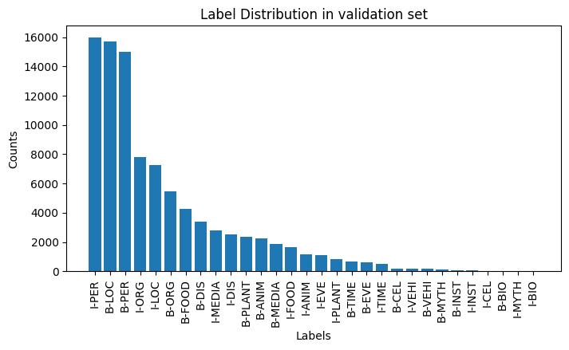

# MultiNERD Fine-Tuning Project

## Description
This project involves fine-tuning a language model on the [MultiNERD dataset](https://huggingface.co/datasets/Babelscape/multinerd?row=17) for Named Entity Recognition (NER) tasks. The focus is on two systems:
- System A: Fine-tuning on the English subset.
- System B: Fine-tuning on a subset of the dataset with specific 5 entity types: `PERSON(PER), ORGANIZATION(ORG), LOCATION(LOC), DISEASES(DIS), ANIMAL(ANIM)` as well as the `O` tag (all other entities will be set to zero).

## Requirements
To install the required packages, run:
```
pip install -r requirements.txt
```
### Framework Versions
Python: 3.10.12

SpanMarker: 1.5.0

Transformers: 4.35.2

PyTorch: 2.1.0+cu118

Datasets: 2.15.0

Tokenizers: 0.15.0

## Usage
The project has been done on Google Colab (with 1 V100 GPU).

For details, please open `Named Entity Recognition.ipynb` via Colab.

## Dataset
The dataset used is the MultiNERD dataset, which is a multi-lingual NER dataset. 
For System A, the dataset is the English subset.
For System B, the dataset is filtered to include only certain entity types.

## Models
The pre-trained model [tomaarsen/span-marker-mbert-base-multinerd](https://huggingface.co/tomaarsen/span-marker-mbert-base-multinerd) used for fine-tuning comes from Hugging Face's Transformers library.

To review their results and training script of this pre-trained model, please refer to the official model page: [tomaarsen/span-marker-mbert-base-multinerd](https://huggingface.co/tomaarsen/span-marker-mbert-base-multinerd).


Maximum Sequence Length: 256 tokens

Maximum Entity Length: 8 words

### **The fine-tuned checkpoints of System A and System B are provided [here](models/readme.md).**

## **More about System A**


**Training Hyperparameters**

- learning_rate: 5e-05

- train_batch_size: 16

- eval_batch_size: 16

- seed: 42

- gradient_accumulation_steps: 2

- total_train_batch_size: 32

- optimizer: Adam with betas=(0.9,0.999) and epsilon=1e-08

- lr_scheduler_type: linear

- lr_scheduler_warmup_ratio: 0.1

- num_epochs: 3


**Testing** 

(also available at `models/test_results_A.json`)


## **More about System B**


**Training Hyperparameters**

- learning_rate: 5e-05

- train_batch_size: 16

- eval_batch_size: 16

- seed: 42

- gradient_accumulation_steps: 2

- total_train_batch_size: 32

- optimizer: Adam with betas=(0.9,0.999) and epsilon=1e-08

- lr_scheduler_type: linear

- lr_scheduler_warmup_ratio: 0.1

- num_epochs: 3


**Testing** 

(also available at `models/test_results_B.json`)


# Conclusion

In this project (NER task on MultiNERD English subset), I observed distinct outcomes for System A and System B, each fine-tuned using the same pre-trained model. 

System A, which utilized the full scope of the English subset, demonstrated slightly better performance (on the English subset) than the pre-trained model. 

Conversely, System B, focused on a subset of entities (PERSON, ORGANIZATION, LOCATION, DISEASES, ANIMAL), showed better performance in these specific entities. This specialization allowed for more targeted learning, leading to improved accuracy on these entities but at the expense of a narrower overall understanding.

Illustrating the data distribution of [training set](img/distribution_train.png), [validation set](img/distribution_val.png), and [testing set](img/distribution_test.png), obviously, they are "**long tails**".

  

It is a common challenge for each downstream task that models should tackle the long-tail distributed data. This can also explain why in System A and System B, the model performs *worse* in recognizing some specific entities on the 'tail', such as `BIO`, `FOOD`, and `DIS`, than the entities on the 'head' such as `PER` and `LOC`.

To tackle this **long-tail** challenge, we can collect more data 'on the tail' thus establishing a relatively less biased dataset.

However, it is not that easy to establish such a dataset. 
Considering 
*   "Ambiguity" (e.g., "apple" can be a fruit or a company),
*   "Cross-cultural/Multilingual",
*   "Non-standardized/Unstructured data" (e.g., how we talk/write in social media),
*   "New entities/words",
*   "Expertise" (e.g., in science and laws, there will be a vast number of specialized entity types.)
*   "High-quality annotation" (e.g., might require annotators with specialized knowledge.)
  
we can get inspired by approaches/concepts from some other research domains, such as [IMGA](https://github.com/yansen0508/IMGA) and [MDR](https://github.com/yansen0508/Mental-Deep-Reverse-Engineering).
